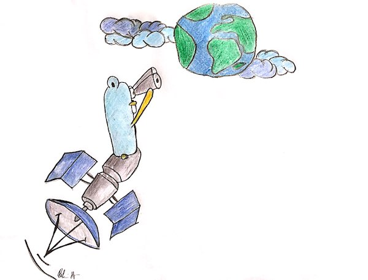

[](https://goreportcard.com/report/github.com/banzaicloud/satellite)
[](https://hub.docker.com/r/banzaicloud/satellite/)

*Satellite is a Golang library and RESTful API that determines a host's cloud provider with a simple HTTP call. Behind the scenes, it uses file systems and provider metadata to properly identify cloud providers.*

---

# Satellite(SAT)

<p align="center">

</p>

Satellite is widely used across the [Pipeline](https://github.com/banzaicloud/pipeline) platform. We are cloud agnostic but at the same time cloud aware - using the [Banzai Cloud](https://banzaicloud.com) Kubernetes operators all our code relies on Satellite to determine the **cloud provider** and *inject* the cloud specific code.

With this simple service the cloud provider can be determined easily with a simple HTTP call.

## Supported Cloud Providers

- Amazon
- Alibaba Cloud
- Azure
- Google Cloud
- Oracle Cloud
- DigitalOcean

## API

- GET "/satellite" -> {name: cloudprovider}

## Helm chart

You can deloy Satellite to a cloud based Kubernetes cluster using this [Helm chart](https://github.com/banzaicloud/banzai-charts/tree/master/satellite). 

To install the chart from the Banzai Cloud chart repo:

```
$ helm repo add banzaicloud-stable http://kubernetes-charts.banzaicloud.com/branch/master
$ helm install banzaicloud-stable/satellite
```

## Examples

The Banzai Cloud PVC operator uses Satellite in order to keep Helm charts cloud `agnostic`. For further details please check the [PVC operator](https://github.com/banzaicloud/pvc-operator/blob/master/README.md).

This operator makes using [Kubernetes Persistent Volumes](https://kubernetes.io/docs/concepts/storage/persistent-volumes/) easier on cloud providers, by dynamically creating the required accounts, classes and more. It allows to use exactly the same [Helm](https://helm.sh) chart on all the supported providers, there is no need to create cloud specific Helm charts.


## Contributing

If you find this project useful here's how you can help:

- Send a pull request with your new features and bug fixes
- Help new users with issues they may encounter
- Support the development of this project and star this repo!
